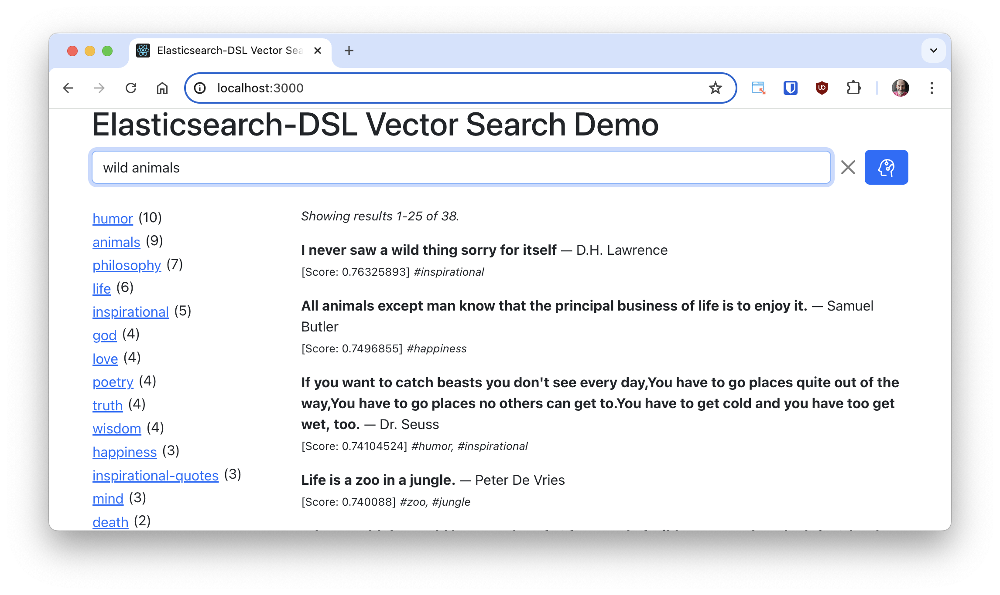

# Quotes
Quotes database with vector search, implemented with Elasticsearch, FastAPI and
React.



## What is this?

This repository contains a small application that demonstrates how easy it is
to set up a vector database using [Elasticsearch](https://www.elastic.co/elasticsearch)
and the [Elasticsearch-DSL](https://elasticsearch-dsl.readthedocs.io/) client
for Python.

The application includes a FastAPI back end and a React front end written in
TypeScript. The quotes are stored in an Elasticsearch index, and for each quote
an embedding is generated using the
[all-MiniLM-L6-v2](https://huggingface.co/sentence-transformers/all-MiniLM-L6-v2)
Sentence Transformers model.

The dataset used by this application has about 37,000 famous quotes, each with
their author and tags. The data originates from a
[Kaggle dataset](https://www.kaggle.com/datasets/akmittal/quotes-dataset) that
appears to have been generated from quotes that were scraped from the Goodreads
[popular quotes](https://www.goodreads.com/quotes) page.

## Requirements

Please make sure you have the following installed:

- Python 3.8 or newer
- Node.js 18 or newer
- Docker

## How To Run

Follow these steps to install this demo on your computer:

### Clone this repository

Run the following command to install a copy of this project on your computer:

```bash
git clone https://github.com/miguelgrinberg/quotes
cd quotes
```

### Install the Node and Python dependencies

Run the following command to set up the JavaScript and Python environment and
install all the dependencies:

```bash
npm install
```

### Start a development Elasticsearch container

Run this command to start a single-node Elasticsearch instance:

```bash
docker run -p 9200:9200 -d --name elasticsearch \
  -e "discovery.type=single-node" \
  -e "xpack.security.enabled=false" \
  -e "xpack.security.http.ssl.enabled=false" \
  -e "xpack.license.self_generated.type=basic" \
  -v "./backend/data:/usr/share/elasticsearch/data" \
  docker.elastic.co/elasticsearch/elasticsearch:8.14.3
```

### Create the quotes database

Run this command in your terminal:

```bash
npm run ingest
```

Note that depending on your computer speed and wether you have a GPU or not this
may take a few minutes.

### Start the back end

Run this command in your terminal:

```bash
npm run backend
```

### Start the front end

Open a second terminal window and run this command:

```bash
npm start
```

You can now navigate to `http://localhost:3000` on your web browser to access
the application.
